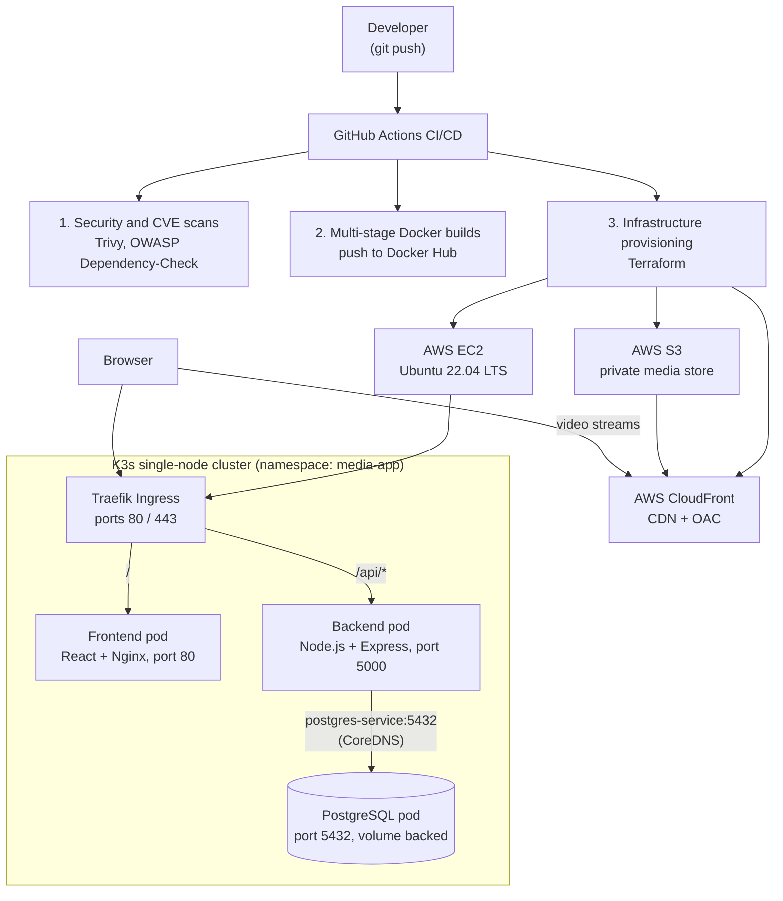

# Netflix Clone: End-to-End DevSecOps Architecture on AWS

An automated, enterprise-grade DevSecOps deployment of a 3-tier Netflix clone microservices platform.

This project:

- Provisions cloud infrastructure with **Terraform**
- Orchestrates microservices with **K3s (Kubernetes)** and **Traefik Ingress**
- Accelerates global media delivery with **AWS CloudFront (CDN)** and **S3**
- Automates testing, security scanning, and deployments with **GitHub Actions**

---

## Table of Contents

- [Architecture Overview](#architecture-overview)
- [Key Architectural Decisions](#key-architectural-decisions)
- [Tech Stack](#tech-stack)
- [Repository Structure](#repository-structure)
- [Prerequisites & Configuration](#prerequisites--configuration)
- [Deployment Guide](#deployment-guide)
- [Operational Troubleshooting](#operational-troubleshooting)
- [Teardown & Resource Cleanup](#teardown--resource-cleanup)
- [License](#license)

---

## Architecture Overview



---

## Key Architectural Decisions

- **3-tier microservices architecture:** independent scaling and lifecycle management for the React client, the Node.js Express API, and the PostgreSQL storage engine.
- **Traefik Ingress Controller:** handles layer-7 routing at the cluster boundary, sending root traffic (`/`) to the frontend service and API traffic (`/api/*`) to the backend service.
- **Low-latency streaming:** raw video is decoupled from the application servers, stored in AWS S3, and delivered directly to the browser through CloudFront Origin Access Control (OAC).
- **Network isolation:** database traffic stays entirely inside the K3s virtual network, resolved through Kubernetes CoreDNS (`postgres-service.media-app.svc.cluster.local`).

---

## Tech Stack

| Domain | Technologies |
| --- | --- |
| **Cloud Provider** | Amazon Web Services (EC2, S3, CloudFront, IAM, Security Groups) |
| **Infrastructure as Code** | Terraform (HashiCorp) |
| **Containerization & Orchestration** | Docker Engine, K3s (lightweight Kubernetes), Traefik Ingress |
| **Frontend** | React.js, Tailwind CSS, Axios, multi-stage Nginx Alpine |
| **Backend API** | Node.js, Express.js, `pg` (connection pooling), Prometheus client |
| **Database** | PostgreSQL 15 |
| **CI/CD & Security** | GitHub Actions, Trivy (image and vulnerability scanning), OWASP Dependency-Check |

---

## Repository Structure

```text
.
├── .github/
│   └── workflows/
│       ├── deploy.yml                   # CI/CD: scans, builds, provisions, and deploys
│       └── destroy.yml                  # Automated infrastructure teardown pipeline
│
├── frontend/                            # React client microservice
│   ├── public/
│   │   ├── index.html
│   │   └── favicon.ico
│   ├── src/
│   │   ├── components/
│   │   │   ├── Banner.js
│   │   │   ├── Navbar.js
│   │   │   ├── Row.js
│   │   │   └── VideoPlayer.js           # CloudFront direct-stream consumer
│   │   ├── App.js
│   │   ├── index.js
│   │   └── styles.css
│   ├── nginx.conf                       # Client-side SPA routing configuration
│   ├── Dockerfile                       # Multi-stage production container build
│   ├── .dockerignore
│   └── package.json
│
├── backend/                             # Node.js API microservice
│   ├── src/
│   │   ├── config/
│   │   │   └── db.js                    # PostgreSQL connection pooling
│   │   ├── routes/
│   │   │   ├── auth.js                  # Authentication routes (JWT, bcrypt)
│   │   │   └── videos.js                # Video catalog and stream URL resolution
│   │   └── server.js                    # Server init, /health, and /metrics
│   ├── Dockerfile                       # Lightweight Alpine Node image
│   ├── .dockerignore
│   └── package.json
│
├── db/                                  # Database schema and seed scripts
│   ├── init.sql                         # Table definitions (users, videos)
│   └── seed.sql                         # Initial catalog data
│
├── terraform/                           # Infrastructure as Code
│   ├── main.tf                          # Compute, storage, CDN, and security resources
│   ├── variables.tf                     # Input variable declarations
│   ├── outputs.tf                       # Exported state (IPs, DNS endpoints, bucket IDs)
│   ├── providers.tf                     # AWS and TLS provider constraints
│   └── terraform.tfvars                 # Environment variable configuration
│
├── k8s/                                 # Kubernetes manifests
│   ├── namespace.yaml                   # Isolated runtime namespace (media-app)
│   ├── configmap.yaml                   # Non-sensitive runtime variables
│   ├── secrets.yaml                     # Base64-encoded database credentials
│   ├── postgres/
│   │   ├── postgres-pvc.yaml            # Persistent volume claim for the database
│   │   └── postgres-deployment.yaml     # Postgres container and ClusterIP service
│   ├── backend/
│   │   └── backend-deployment.yaml      # Express API deployment and service
│   ├── frontend/
│   │   └── frontend-deployment.yaml     # Nginx-wrapped React client deployment
│   └── ingress.yaml                     # Traefik routing rules for root and API paths
│
├── scripts/                             # Operational utilities
│   ├── setup-k3s.sh                     # Host configuration and cluster bootstrap
│   └── seed-db.sh                       # Wrapper to run database seed queries
│
├── .gitignore
├── LICENSE
└── README.md
```

---

## Prerequisites & Configuration

### 1. Required credentials

Add the following secrets to your GitHub repository under **Settings → Secrets and variables → Actions**:

| Secret | Description |
| --- | --- |
| `AWS_ACCESS_KEY_ID` | IAM access key for deployment (administrative or scoped) |
| `AWS_SECRET_ACCESS_KEY` | Secret for the IAM access key above |
| `DOCKERHUB_USERNAME` | Docker Hub account username |
| `DOCKERHUB_TOKEN` | Docker Hub Personal Access Token (PAT) |

### 2. Local tooling (optional, for manual execution)

- **AWS CLI v2** (`aws --version`), configured with default region `us-east-1`
- **Terraform CLI v1.5+** (`terraform --version`)
- **kubectl** (`kubectl version --client`)

---

## Deployment Guide

### Step 1: Provision infrastructure (Terraform)

Run Terraform locally, or trigger the GitHub Actions deploy workflow:

```bash
cd terraform

# 1. Initialize provider plugins and backend state
terraform init

# 2. Validate the configuration and generate an execution plan
terraform plan -out=tfplan

# 3. Apply the plan
terraform apply tfplan
```

Note the exported outputs (values below are examples):

```text
ec2_public_ip     = "100.48.83.229"
cloudfront_domain = "d111111abcdef8.cloudfront.net"
s3_bucket_name    = "netflix-k8s-media-dev-98234"
```

### Step 2: Bootstrap K3s and deploy Kubernetes resources

SSH into the provisioned EC2 instance:

```bash
ssh -i <your-key.pem> ubuntu@<EC2_PUBLIC_IP>
```

Verify K3s is ready, create the namespace, and apply the manifests:

```bash
# 1. Verify cluster node status
sudo kubectl get nodes -o wide

# 2. Create the application namespace
sudo kubectl apply -f k8s/namespace.yaml

# 3. Apply configuration, database, and microservice manifests
sudo kubectl apply -f k8s/configmap.yaml
sudo kubectl apply -f k8s/secrets.yaml
sudo kubectl apply -f k8s/postgres/
sudo kubectl apply -f k8s/backend/
sudo kubectl apply -f k8s/frontend/

# 4. Deploy the Traefik Ingress routing rules
sudo kubectl apply -f k8s/ingress.yaml

# 5. Watch the rollout until all pods report Running
sudo kubectl get pods -n media-app -w
```

### Step 3: Initialize the database schema and seed data

Create the tables and populate the video catalog with `kubectl exec`:

```bash
sudo kubectl exec -i $(sudo kubectl get pod -n media-app -l app=postgres -o jsonpath="{.items[0].metadata.name}") -n media-app -- psql -U admin -d videodb << 'EOF'

-- 1. Create users table
CREATE TABLE IF NOT EXISTS users (
    id SERIAL PRIMARY KEY,
    username VARCHAR(100) UNIQUE NOT NULL,
    email VARCHAR(255) UNIQUE NOT NULL,
    password_hash TEXT NOT NULL,
    created_at TIMESTAMP DEFAULT CURRENT_TIMESTAMP
);

-- 2. Create videos table
CREATE TABLE IF NOT EXISTS videos (
    id SERIAL PRIMARY KEY,
    title VARCHAR(255) NOT NULL,
    description TEXT,
    thumbnail_url TEXT,
    video_key VARCHAR(255) NOT NULL,
    created_at TIMESTAMP DEFAULT CURRENT_TIMESTAMP
);

-- 3. Seed the video catalog
INSERT INTO videos (title, description, thumbnail_url, video_key) VALUES
('Stranger Things', 'When a young boy vanishes, a small town uncovers a mystery.', 'https://images.unsplash.com/photo-1518709268805-4e9042af9f23?w=800', 'stranger-things.mp4'),
('Money Heist', 'An unusual group of robbers attempt to carry out the most perfect robbery.', 'https://images.unsplash.com/photo-1574375927938-d5a98e8ffe85?w=800', 'money-heist.mp4'),
('Squid Game', 'Hundreds of cash-strapped players accept a strange invitation.', 'https://images.unsplash.com/photo-1626814026160-2237a95fc5a0?w=800', 'squid-game.mp4');

EOF
```

### Step 4: Verify and smoke test

Run these checks from your workstation to confirm end-to-end routing:

```bash
# 1. Health check endpoint
curl -i http://<EC2_PUBLIC_IP>/health

# 2. Fetch the video catalog through the Traefik Ingress rule
curl -i http://<EC2_PUBLIC_IP>/api/videos

# 3. Verify the Prometheus metrics endpoint
curl -i http://<EC2_PUBLIC_IP>/metrics
```

Then open the app in a browser:

```text
http://<EC2_PUBLIC_IP>/
```

The React frontend should render the home catalog with movie posters and CloudFront media links.

---

## Operational Troubleshooting

| Symptom | Probable Cause | Corrective Action |
| --- | --- | --- |
| `ImagePullBackOff` | Invalid registry tag or repository credentials | Run `kubectl describe pod <name> -n media-app` and verify the image tags in the deployment manifests. |
| `HTTP 404: Cannot GET /api` | No matching downstream route | Check the request path. The backend exposes `/api/videos`, `/api/auth/login`, and `/api/auth/register`. |
| `relation "videos" does not exist` | Database tables not initialized | Run the schema initialization script from [Step 3](#step-3-initialize-the-database-schema-and-seed-data). |
| `exec: "/bin/bash": stat /bin/bash: no such file` | Container image is Alpine Linux | Use `/bin/sh` instead of `/bin/bash` with `kubectl exec`. |
| CloudFront `OriginAccessControlInUse` | Distribution changes are still propagating globally | Wait 3 to 5 minutes after deleting the CloudFront distribution before destroying the associated OAC resources. |

---

## Teardown & Resource Cleanup

Tear the environment down when you are done to avoid unnecessary AWS charges.

### Method 1: GitHub Actions (recommended)

1. Open the **Actions** tab in your repository.
2. Select the **🚨 Destroy Infrastructure** workflow.
3. Click **Run workflow**, type `DESTROY` in the confirmation field, and run it.

### Method 2: Local CLI

```bash
cd terraform

# 1. Empty the S3 bucket (AWS blocks deletion of non-empty buckets)
BUCKET_NAME=$(terraform output -raw s3_bucket_name 2>/dev/null)
if [ -n "$BUCKET_NAME" ]; then
  aws s3 rm s3://${BUCKET_NAME} --recursive
fi

# 2. Destroy all cloud resources
terraform destroy -auto-approve

# 3. Verify the resources are gone
aws ec2 describe-instances \
  --region us-east-1 \
  --filters "Name=instance-state-name,Values=shutting-down,terminated" \
  --query "Reservations[].Instances[].[InstanceId,State.Name]" \
  --output table

aws cloudfront list-distributions --output table
```

---

## License

This project is licensed under the terms of the [LICENSE](./LICENSE) file.
